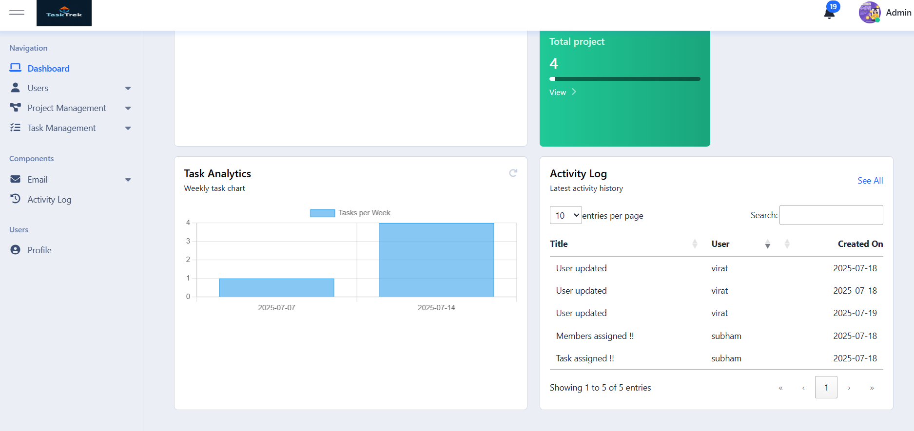
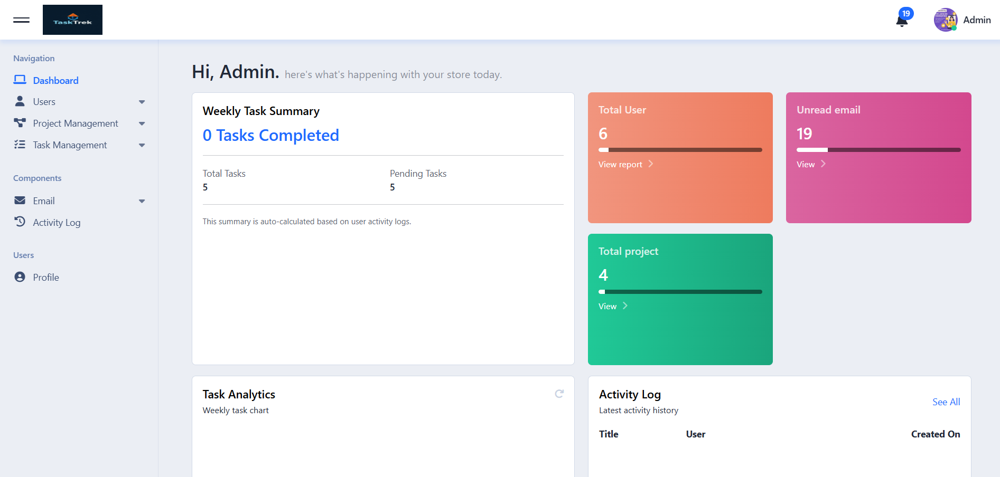
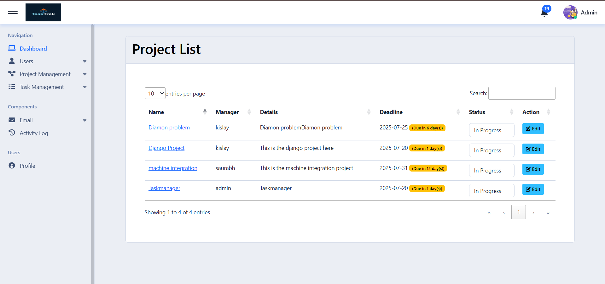
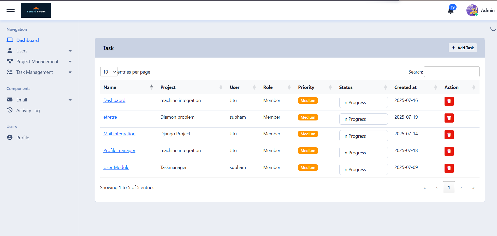
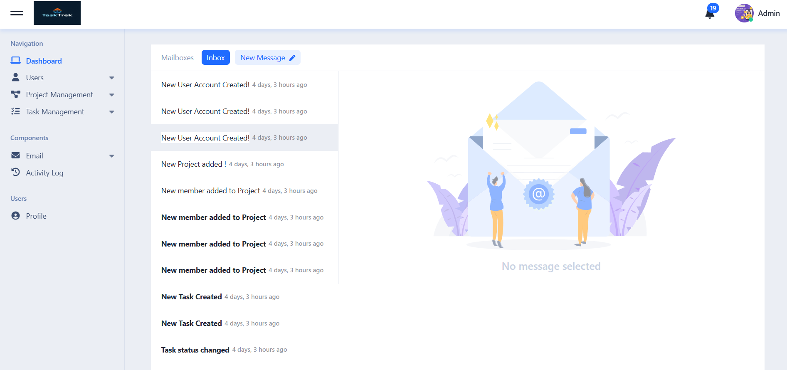
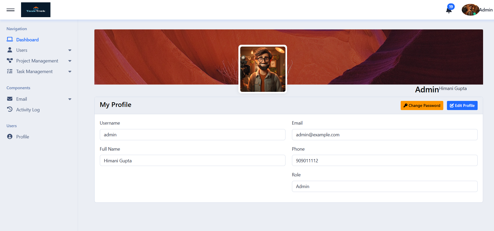
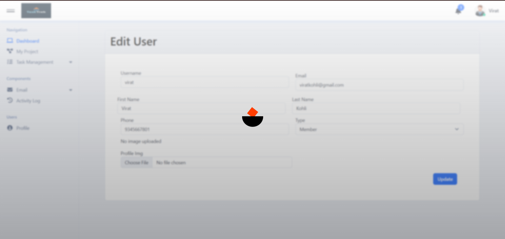

# 📝 Task Management System

A comprehensive task management web application built with **Python Django 5** and **MySQL**, designed for Admins, Managers, and Users to collaborate efficiently. The system provides project assignment, task tracking, email notifications, user roles, and much more.

---

  
*Check the image above for a glimpse of the UI.*

---

## 🚀 Features

### 🔐 Authentication & Authorization
- Role-based access: **Admin**, **Manager**, and **User**
- Secure login and logout functionality
- Django's built-in user model with extended role linkage

### 👤 User Management (Admin)
- Add/update/delete users from the admin panel
- Assign roles directly while creating a user
- Update user profile and password
- Log activity when a new user is created

### 📁 Project Management
- Admin can create and assign projects to managers
- Managers can view, edit and manage project details
- Members (users) can be added to a project from the **Project Detail Page**

### ✅ Task Management
- Admin and Managers can create tasks and assign them to project members
- Each task includes:
  - Title, description, deadline, status
  - Comment section (with file attachment support)
- Users can add comments to tasks
- Activity logging for all important actions

### 📬 Email and Notification System
- Email notifications are sent for key actions like:
  - Task creation
  - Role updates
  - New project assignments
- **Compose Email Interface** with:
  - `To`, `From`, `CC`, `BCC`
  - Subject and body
- Email inbox section for Admin and Manager with read/unread marking

### 🔔 Notifications Panel
- Notifications for Admin and Manager showing task assignments, new users, etc.

### 📂 Attachments & Comments
- Task detail page supports threaded comments
- File upload supported within comments
- Only assigned users can comment

### 📝 Profile Management
- Users can:
  - View and update their profile
  - Upload a profile image
  - Change their password

---

## 🧱 Tech Stack

| Technology       | Description                        |
|------------------|------------------------------------|
| **Python 3.10+**  | Programming Language               |
| **Django 5.x**    | Web Framework                      |
| **MySQL**         | Database                           |
| **HTML/CSS/JS**   | Frontend                          |
| **Bootstrap 5**   | Styling Framework                  |
| **SMTP (Gmail)**  | Email Integration                  |

---

## ⚙️ Installation Steps

1. **Clone the repository**
   ```bash
   git clone https://github.com/yourusername/taskmanagement.git
   cd taskmanagement


Check some images below to understand the UI and workflow of the project.

### 🖥️ Dashboard View



### 📋 Project List



### ✅ Task List


### 🔔 Notification / Inbox


### 👤 User Profile & Settings


### Loader

